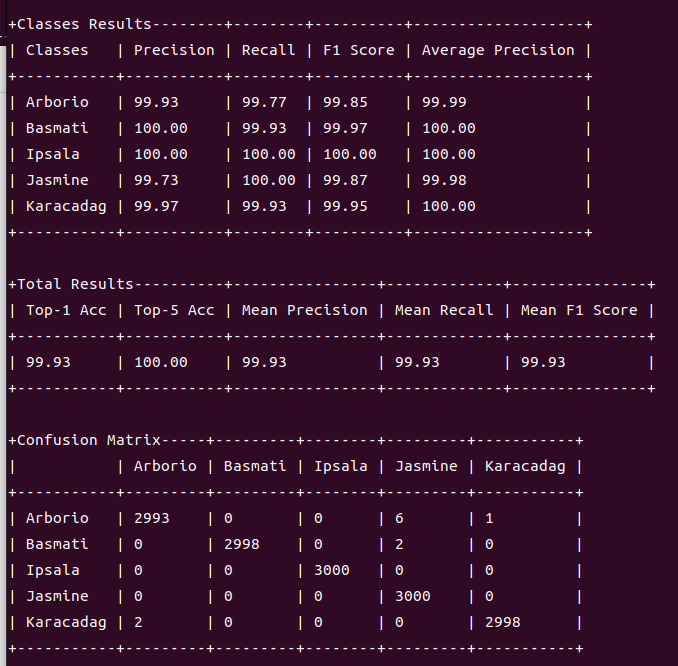
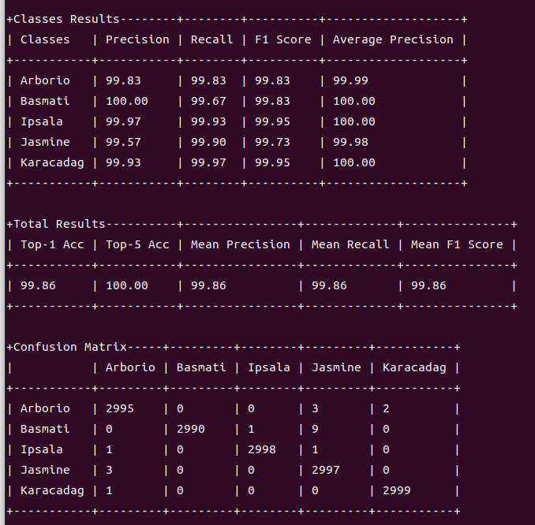

# RiceClassification


## Getting started

1. 從kaggle下載資料集，本專案為縮減專案大小，故不下載
2. 編輯 `datas/annotations.txt`

```
Arborio 0
Basmati 1
Ipsala 2
Jasmine 3
Karacadag 4
```
3.  分割資料集`python.py split_data.py`，參數於split_data.py內調整，本專案請解壓縮datasets.zip
4.  設定`models/`下的模型，本專案挑選vgg19與efficientnetv2
 - num_cls = 5
 - pipeline可以調整augmentation與preprocess
 - epoches調整迭代

5. `python train.py --config models/xxxx.py --split-validation --ratio 0.2`

 - `--split-validation` 從train分出validation，`--ratio`設定比例 

6. `python evaluation.py --config log/run exp time/model name/xxxx.py`
 - xxxx.py是原先model複製過來的，調整ckpt路徑 

7. Test dataset Inference比較

- vgg19
- 

- efficientnetv2
- 

8. `python get_flops.py --config log/run exp time/model name/xxxx.py`

9. FLOPs比較

- vgg19
- 

- efficientnetv2
- 

| model | FLOPs | PARAM |
|:-------:|:-------:|:-------:|
| vgg19 | 19.69 GFLOPs | 139.6M |
| efficientnetv2 | 5.13 GFLOPs | 52.86M  |

10. 比較與結論

vgg與efficientnetv2的準確率相差不大，但是efficientnetv2的FLOPs相較少於vgg，這將更適合部屬於小型裝置或者更新迭代vgg模型

## About This Project

此專案使用Kaggle [稻米影像資料集](https://www.kaggle.com/datasets/muratkokludataset/rice-image-dataset)

```
About this directory

Suggest Edits
Rice Image Dataset
DATASET: https://www.muratkoklu.com/datasets/

Citation Request: See the articles for more detailed information on the data.

Koklu, M., Cinar, I., & Taspinar, Y. S. (2021). Classification of rice varieties with deep learning methods. Computers and Electronics in Agriculture, 187, 106285. https://doi.org/10.1016/j.compag.2021.106285

Cinar, I., & Koklu, M. (2021). Determination of Effective and Specific Physical Features of Rice Varieties by Computer Vision In Exterior Quality Inspection. Selcuk Journal of Agriculture and Food Sciences, 35(3), 229-243. https://doi.org/10.15316/SJAFS.2021.252

Cinar, I., & Koklu, M. (2022). Identification of Rice Varieties Using Machine Learning Algorithms. Journal of Agricultural Sciences https://doi.org/10.15832/ankutbd.862482

Cinar, I., & Koklu, M. (2019). Classification of Rice Varieties Using Artificial Intelligence Methods. International Journal of Intelligent Systems and Applications in Engineering, 7(3), 188-194. https://doi.org/10.18201/ijisae.2019355381

DATASET: https://www.muratkoklu.com/datasets/

Highlights
• Arborio, Basmati, Ipsala, Jasmine and Karacadag rice varieties were used.
• The dataset (1) has 75K images including 15K pieces from each rice variety. The dataset (2) has 12 morphological, 4 shape and 90 color features.
• ANN, DNN and CNN models were used to classify rice varieties.
• Classified with an accuracy rate of 100% through the CNN model created.
• The models used achieved successful results in the classification of rice varieties.

Abstract
Rice, which is among the most widely produced grain products worldwide, has many genetic varieties. These varieties are separated from each other due to some of their features. These are usually features such as texture, shape, and color. With these features that distinguish rice varieties, it is possible to classify and evaluate the quality of seeds. In this study, Arborio, Basmati, Ipsala, Jasmine and Karacadag, which are five different varieties of rice often grown in Turkey, were used. A total of 75,000 grain images, 15,000 from each of these varieties, are included in the dataset. A second dataset with 106 features including 12 morphological, 4 shape and 90 color features obtained from these images was used. Models were created by using Artificial Neural Network (ANN) and Deep Neural Network (DNN) algorithms for the feature dataset and by using the Convolutional Neural Network (CNN) algorithm for the image dataset, and classification processes were performed. Statistical results of sensitivity, specificity, prediction, F1 score, accuracy, false positive rate and false negative rate were calculated using the confusion matrix values of the models and the results of each model were given in tables. Classification successes from the models were achieved as 99.87% for ANN, 99.95% for DNN and 100% for CNN. With the results, it is seen that the models used in the study in the classification of rice varieties can be applied successfully in this field.
```

